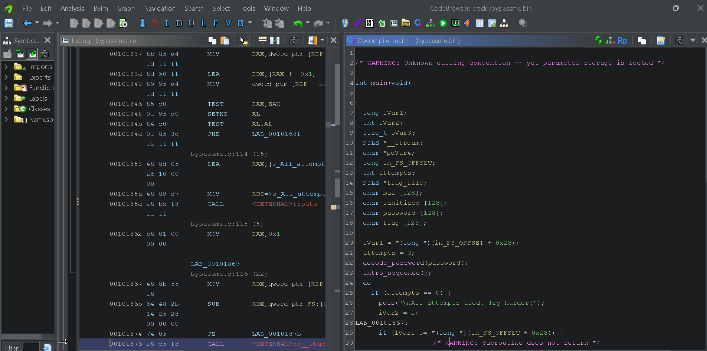

# Bypass me 
- Your task is to analyze and exploit a password-protected binary called bypassme.bin and binary performs input sanitization.
- However, instead of guessing the password, you are expected to reverse engineer or debug the program to bypass the authentication logic and retrieve the hidden flag.
- You'll need to think like an attacker using tool like (LLDB)[https://lldb.llvm.org/use/tutorial.html] to uncover how the binary works under the hood and leak the correct password.
- ## Hướng đi
- Trước tiên ta cần tìm hiểu 1 chút về *lldb*, đây là 1 tool có chức năng tương tự *gdb*, dùng để debugging 1 chương trình <br>
 Đề bài yêu cầu chúng ta xử lý file bypassme.bin, và sẽ kết nối thông qua ssh, tuy nhiên để tiện thì tôi muốn tải nó về kết hợp dùng *ghidra* và *lldb* để giải quyết <br>
 Dùng *scp*
```console
scp username@remote_host:/path/to/remote/file.tx
```
- Ta có thể ssh vào trước, kiểm tra đường dẫn hiện tại bằng `pwd` sau đó mới tải về.<br>
Sau đó ta sẽ được: <br>


- Giờ ta sẽ vào phân tích <br>
```console
    printf("\n[%d tries left] Enter password: ",(ulong)(uint)attempts);
    fflush(stdout);
    fgets(buf,0x80,stdin);
    sVar3 = strcspn(buf,"\n");
    buf[sVar3] = '\0';
    sanitize(buf,sanitized);
    printf("\nRaw Input:      [%s]\n",buf);
    printf("Sanitized Input:[%s]\n",sanitized);
    puts("Hint: Input must match something special...");
```
- Chú ý ngay đến đoạn này, có vẻ như chúng ta cần nhập vào 1 password, nó sẽ **match** với 1 cái gì đó.

```console
    iVar2 = strcmp(buf,password);
    if (iVar2 == 0) {
      auth_sequence();
      __stream = fopen("../../root/flag.txt","r");
```

- Thật vậy nó kiểm tra `iVar2 = strcmp(buf,password)` và đưa ra flag nếu đúng `__stream = fopen("../../root/flag.txt","r");` <br>
Chúng ta cùng đi vào xem nó kiểm tra với cái gì nhé: <br>
- Ở đây: `blur` chính là *input* của chúng ta, nó được so sánh với *password*, ta sẽ lần theo biến này. <br>
```console
char password [128]
decode_password(password);
```
- Vậy ra *password* được xử lý trong hàm `decode_password`, nhấp vào hàm này để xem: <br>
```console

void decode_password(char *out)

{
  long lVar1;
  long in_FS_OFFSET;
  char *out_local;
  int i;
  uchar enc [11];
  
  lVar1 = *(long *)(in_FS_OFFSET + 0x28);
  enc[0] = 0xf9;
  enc[1] = 0xdf;
  enc[2] = 0xda;
  enc[3] = 0xcf;
  enc[4] = 0xd8;
  enc[5] = 0xf9;
  enc[6] = 0xcf;
  enc[7] = 0xc9;
  enc[8] = 0xdf;
  enc[9] = 0xd8;
  enc[10] = 0xcf;
  for (i = 0; (uint)i < 0xb; i = i + 1) {
    out[i] = enc[i] ^ 0xaa;
  }
  out[0xb] = '\0';
  if (lVar1 != *(long *)(in_FS_OFFSET + 0x28)) {
                    /* WARNING: Subroutine does not return */
    __stack_chk_fail();
  }
  return;
}
```
- Ta thấy chương trình khởi tạo `enc` gồm 11 phần tử, sau đó dùng vòng `for` để xử lý từng phần từ, cuối cùng `return` ra `out`, cũng chính là **pasword** cần tìm.
- Nhìn vào vòng `for` <br>
```console
for (i = 0; (uint)i < 0xb; i = i + 1) {
    out[i] = enc[i] ^ 0xaa;
  }
```
- Thao tác xử lý sẽ là `XOR` từng phần tử của `enc` với `0xaa` rồi đưa vào `out`. <br>
Vậy là ta đã nắm được các xử lý của chương trình này.<br>
Đến đây có 2 hướng: <br>
- Viết 1 trương trình python để `XOR` luôn `enc` vì ta đã biết được tất cả các phần tử.
- Hoặc dùng `lldb` như yêu cầu của đề bài <br>
Tôi sẽ đi theo cách 2 cho phù hợp với đề nhé: <br>
Tôi tiến hành kết nối với server: <br>
