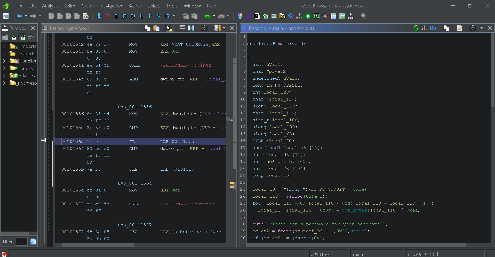

# Secure Password Database
- Đây là 1 bài mức độ medium, <br>
- I made a new password authentication program that even shows you the password you entered saved in the database! <br>
  Isn't that cool? [system.out](https://challenge-files.cylabacademy.net/library/c78772efebbd915d804bd7525802ffbf4dfbe0789663066904b37c730bc78498/system.out)
## Hướng đi 
- Trước tiên ta thấy đề bài cho ta 1 file đuôi *.out* là 1 file *.out*, nó được biên soạn bởi trình biên dịch. Hiểu đơn giản là 1 file có thể chạy được. <br>
Đến đây tôi chạy thử file hoặc kết nối với sever của đề bài để chạy thử thì: <br>
``` console
shingo333-academy@webshell:~$ nc xebec.cylabacademy.net 23755
Please set a password for your account:
hieu
How many bytes in length is your password?
4
You entered: 4
Your successfully stored password:
104 105 101 117 10 
Enter your hash to access your account!
d
system.out: heartbleed.c:69: main: Assertion `1 == 0' failed.
Aborted (core dumped)
```
- Chương trình yêu cầu tôi nhập password, số byte của password và cuối dùng là hash để có thể log vào tài khoản (có thể chứa flag)<br>
- Để xem chương trình làm gì, tôi sẽ sử dụng 1 công cụ là *Ghidra*, bạn có thể tham khảo ở [đây](https://github.com/nationalsecurityagency/ghidra)<br>
Tiến hành mở file trong *Ghidra* và nhấn phân tích khi *Ghidra* gợi ý phân tích, sau đó là đến hàm *main* mà *Ghidra* phát hiện ra tôi sẽ được một giao diện kiểu như: <br>


- Chúng ta sẽ cùng phân tích hàm *main* này: <br>
(Chúng ta sẽ đi vào các phần quan trọng luôn nhé) <br>
```c
  puts("Please set a password for your account:");
  pcVar2 = fgets(acStack_b9 + 1,0x32,stdin);
```
- Đoạn này lấy input của người dùng ném nào vào pcVar2 (đây chỉ là cái tên được Ghidra tự đặt) <br>
```c
  if (pcVar2 != (char *)0x0) {
    strcpy(local_110,acStack_b9 + 1);
```
- Tiếp theo kiếm tra nó để chắc chắn người dùng đẫ điền, sau đó sao chép nso vào địa chỉ *local_110*, chỉ là 1 vùng nhớ thôi nhé. <br>
```c
    puts("How many bytes in length is your password?");
    pcVar2 = fgets(local_d8,0x14,stdin);
    if (pcVar2 != (char *)0x0) {
      uVar1 = atoi(local_d8);
      printf("You entered: %d\n",(ulong)uVar1);
      puts("Your successfully stored password:");
```
- Đoạn sau cũng làm tương tự như vậy, sau đó in ra ACSII của từng chữ cái trong password thôi, chưa làm gì thêm cả. <br>
```c
  puts("Enter your hash to access your account!");
  pcVar2 = fgets(acStack_b9 + 1,0x32,stdin);
  if (pcVar2 != (char *)0x0) {
    local_108 = strlen(acStack_b9 + 1);
    if ((local_108 != 0) && (acStack_b9[local_108] == '\n')) {
      acStack_b9[local_108] = '\0';
    }
    local_100 = strtoul(acStack_b9 + 1,&local_120,10);
    if (local_120 == acStack_b9 + 1) {
      printf("No digits were found");
                    /* WARNING: Subroutine does not return */
      __assert_fail("1 == 0","heartbleed.c",0x45,"main");
    }
```
- Đây là đoạn nhận hash từ người dùng, ta nên để ý kĩ hơn. <br>
Dễ thấy nó đang thực hiện 1 số thao tác xử lý cơ bản và cũng không ảnh hướng nhiều đến input và cũng không phải đoạn quan trọng nhất mà ta cần tìm. <br>
- Tôi chú ý vào local_100 chứa các số nguyên không dấu được chuyển từ dãy hash của chúng ta từ hàm *strtuol* <br>
```c
    local_f8 = make_secret(local_e5);
    if (local_f8 == local_100) {
      local_f0 = fopen("flag.txt","r");
```
- Đây mới chính là đoạn quan trọng, chương trình gọi hàm `make_secret` để xử lý, đầu vào là 1 vùng nhớ local_e5, sau đó so sánh nó với input dạng số thập phân của chúng ta để mở file *flag.txt*. Vậy là mấu chốt sẽ nằm ở hàm `make_secret`. Ta sẽ vào hàm này:
```c
void make_secret(long param_1)

{
  long local_10;
  
  for (local_10 = 0; obf_bytes[local_10] != '\0'; local_10 = local_10 + 1) {
    *(byte *)(local_10 + param_1) = obf_bytes[local_10] ^ 0xaa;
  }
  *(undefined1 *)(param_1 + 0xc) = 0;
  hash(param_1);
  return;
}
```
- Ở hàm này ta thấy nó lấy từng byte ở vùng obf_bytes để XOR với 0^aa, sau khi kiếm tra vùng này ta thu được: <br>
```python
obf_bytes = [0xC3, 0xFF, 0xC8, 0xC2, 0x92, 0x9B, 0x8B, 0xC0, 0x80, 0xC2, 0xC4, 0x8B, 0x00]
```
- Sau đó chương trình gọi hàm `hash` để xử lý tiếp: <br>
- Đây là hàm `hash`:
```c

long hash(byte *param_1)

{
  byte *local_20;
  long local_10;
  
  local_10 = 0x1505;
  local_20 = param_1;
  while( true ) {
    if (*local_20 == 0) break;
    local_10 = (long)(int)(uint)*local_20 + local_10 * 0x21;
    local_20 = local_20 + 1;
  }
  return local_10;
}

```
- Ta nhận thấy 1 điều là chương trình hoàn toàn không phụ thuộc vào password và số bytes mà ta nhập vào, tức là kết quả hash là cố định. Do đó ta sẽ đổi hướng đi: <br>
- Ở đây ta có thể viết 1 chương trình python thực hiện giống bên trên với input là obf_bytes để đưa ra hash (trình bày sao). <br>
Với bài này tôi sẽ dùng 1 công cụ là *gdb* - Đây là 1 công cụ dùng để gỡ lỗi (debugger) phổ dành cho Linux,... để có thể đọc trực tiếp giá trị hash của chương trình khi nó thực thi.<br>
**Tải** <br>
- Bạn có thể dùng lệnh sau để tải <br>
```console
sudo apt install gdb
```
- Sau khi có *gdb* ta sẽ tiến hành xử lý thôi: <br>
```console
hieu@LAPTOP-OQUPSESK:/mnt/c/Users/admin/Downloads$ gdb system.out
GNU gdb (Ubuntu 15.1-1ubuntu1~24.04.1) 15.1
Copyright (C) 2024 Free Software Foundation, Inc.
License GPLv3+: GNU GPL version 3 or later <http://gnu.org/licenses/gpl.html>
This is free software: you are free to change and redistribute it.
There is NO WARRANTY, to the extent permitted by law.
Type "show copying" and "show warranty" for details.
This GDB was configured as "x86_64-linux-gnu".
Type "show configuration" for configuration details.
For bug reporting instructions, please see:
<https://www.gnu.org/software/gdb/bugs/>.
Find the GDB manual and other documentation resources online at:
    <http://www.gnu.org/software/gdb/documentation/>.

For help, type "help".
Type "apropos word" to search for commands related to "word"...
Reading symbols from system.out...

This GDB supports auto-downloading debuginfo from the following URLs:
  <https://debuginfod.ubuntu.com>
Enable debuginfod for this session? (y or [n]) y
Debuginfod has been enabled.
To make this setting permanent, add 'set debuginfod enabled on' to .gdbinit.
Downloading separate debug info for /mnt/c/Users/admin/Downloads/system.out
(No debugging symbols found in system.out)
(gdb)
```
- Như trên, ta sẽ dùng `gdb [file-name]` để tiến hành debugging. <br>
- Tiếp theo là đặt breakpoint, ta dùng
```console
(gdb) b hash
Breakpoint 1 at 0x1311
```
- 'b' là viết tắt của breakpoint <br>
- Sau đó chạy file bằng `run` <br>
Ta sẽ được:
```console
(gdb) run
Starting program: /mnt/c/Users/admin/Downloads/system.out
Downloading separate debug info for system-supplied DSO at 0x7ffff7fc3000
[Thread debugging using libthread_db enabled]
Using host libthread_db library "/lib/x86_64-linux-gnu/libthread_db.so.1".
Please set a password for your account:
hieu
How many bytes in length is your password?
4
You entered: 4
Your successfully stored password:
104 105 101 117 10
Enter your hash to access your account!
123

Breakpoint 1, 0x0000555555555311 in hash ()
(gdb)
```
- Nhập lệnh `finish` để *gdb* chạy hết hàm `hash`, lúc này kết quả hash đã được tính xong về đang nằm trong thanh ghi **rax** (đây là thanh ghi thường dùng để chứa giá trị return từ 1 hàm). <br>
- Để đọc giá trị ở thanh ghi này ta có thể dùng <br>
- `inf reg` hoặc `p/d $rax` (p là print, d là decimal) <br>
```console
(gdb) p/d $rax
$1 = -3209081493549540382
```
Ta đều nhận được kết quả là -3209081493549540382 <br>
## Lấy flag 
- Giờ ta launch instance sau đó kết nối với server, chạy chương trình là nhập password and số bytes tùy ý. Cuối cùng nhập hash là kết quả ta vừa tìm được và ting ting ta nhận được flag (tự tìm ^ ^).
